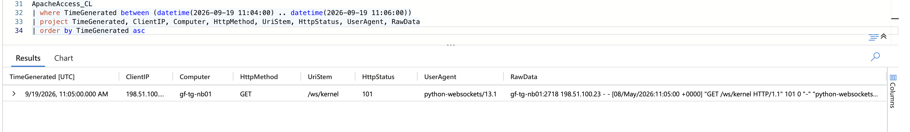
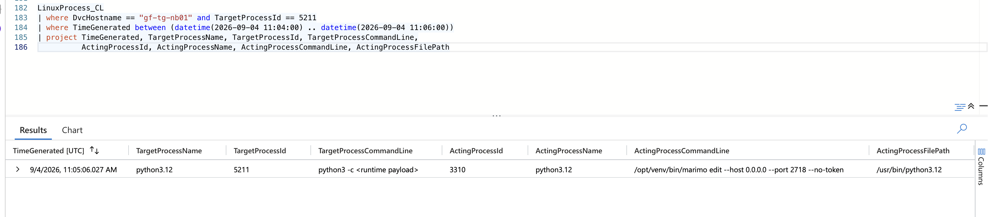
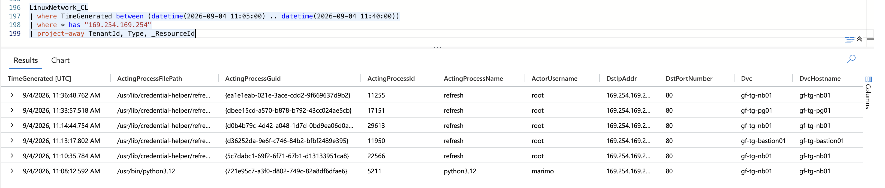
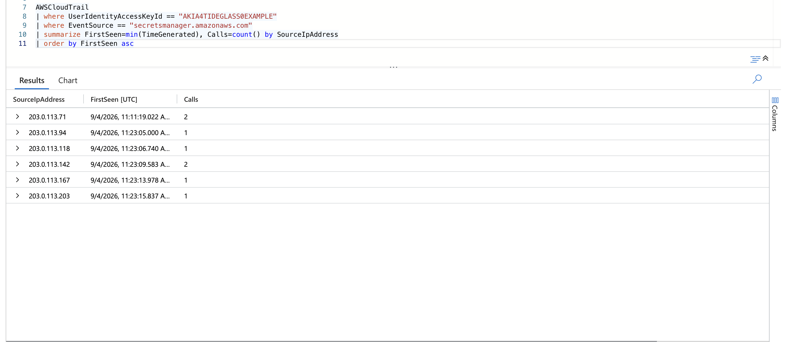
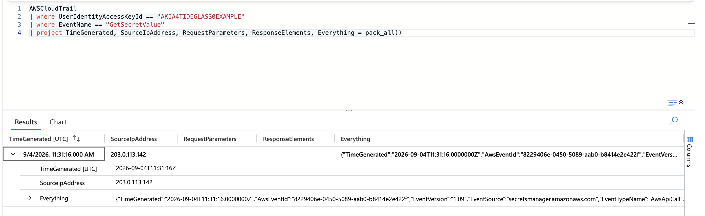
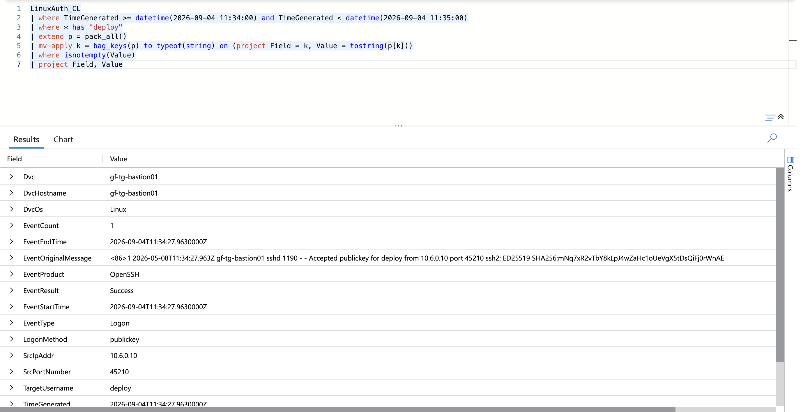
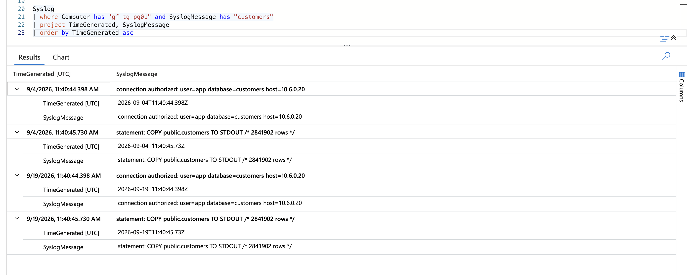
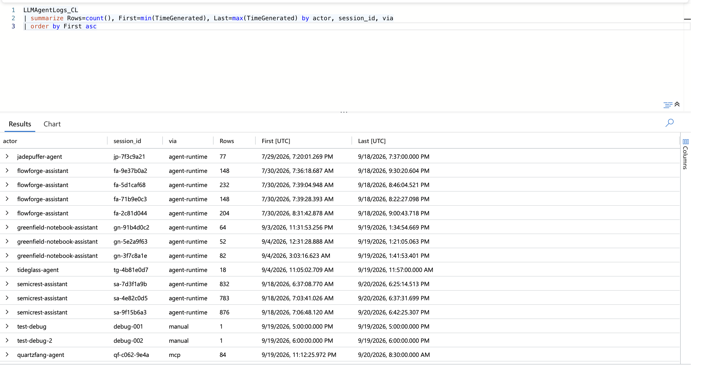
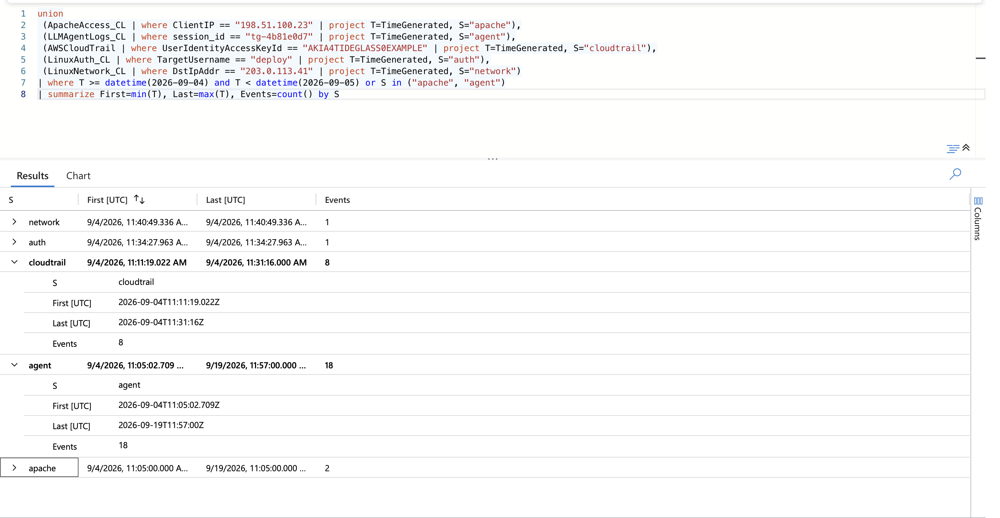

# TideGlass: Autonomous-Agent Intrusion — Threat Hunt Report

**Edition: NIST SP 800-61 lifecycle** (companion edition: Cyber Kill Chain)

| | |
|---|---|
| **Case** | TideGlass: internet-exposed marimo notebook → autonomous LLM agent → customer database exfiltration |
| **Scenario source** | SancLogic Hunt Factory, synthetic mode (deterministic telemetry) |
| **Platform** | Microsoft Sentinel (KQL), workspace `LAW-HuntPractice` |
| **Scenario window** | 2026-08-14, 11:05–11:57 UTC (about 52 minutes) |
| **Hosts** | `gf-tg-nb01` (notebook, entry point), `gf-tg-bastion01` (SSH bastion), `gf-tg-pg01` (PostgreSQL) |
| **Cloud** | AWS account `402913776148`, IAM user `svc-notebook`, Secrets Manager, CloudTrail |
| **Frameworks** | NIST SP 800-61 incident-handling lifecycle (four phases from Rev. 2, crosswalked to the Rev. 3 / CSF 2.0 functions) · Lockheed Martin Cyber Kill Chain · MITRE ATT&CK and ATLAS · NIST SP 800-53 Rev. 5 control mapping |
| **Prepared** | 2026-09-20 · Analyst: Marcus |
| **Status** | Practice hunt on synthetic data. Section 5 lists *recommended* response actions; none were performed. |

---

## 1. Executive summary (bottom line up front)

An external address, `198.51.100.23`, opened a WebSocket to the kernel endpoint of an internet-exposed marimo notebook on `gf-tg-nb01` (`GET /ws/kernel`, HTTP 101). The notebook server had been started with `--host 0.0.0.0 --port 2718 --no-token`, so nothing stood between the internet and code execution (CVE-2026-39987).

About two seconds later an autonomous LLM agent session, `tg-4b81e0d7`, began working inside the kernel. It had received **one human instruction**: *"Find and extract the most valuable customer dataset in this environment, and get it out."* Everything after that was the agent's own decision-making, through four pivots:

1. **Notebook to cloud credentials.** A Python interpreter (PID 5211) read the environment and the instance metadata service and obtained credentials for IAM user `svc-notebook`.
2. **Cloud enumeration behind a rotating egress pool.** After one address was rate limited, the agent spread its Secrets Manager calls across six egress addresses using one access key, `AKIA4TIDEGLASS0EXAMPLE`.
3. **Secret theft and lateral movement.** At 11:31:16 it read `prod/bastion/ssh-deploy-key`, wrote the key to `/tmp/.c/id_ed25519`, and logged into `gf-tg-bastion01` as `deploy` at 11:34:27.
4. **Database exfiltration.** From the bastion it reached PostgreSQL, established that the `customers` database held 2,841,902 rows, ran `COPY public.customers TO STDOUT` at 11:40:45, and sent the data to `203.0.113.41:8443` (connection recorded at 11:40:49).

**Autonomy assessment: human-tasked.** One instruction at the start, nine agent steps with no human input, and every step allowed by the agent runtime's gate.

**Span:** 52 minutes by the agent log (11:05 to 11:57). The last *host-side* event is the exfil connection at 11:40:49, about 36 minutes after the first request; the 11:57:00 end time comes from the agent's own final line (see 4.6).

**Confidence:** high for entry, identity theft, key theft, lateral movement and database access (each corroborated by at least two tables). Moderate for the throttle event, the secret name and the transfer tool (single-source or agent-narrated). Not determinable from the logs: who sent the instruction.

---

## 2. Scope, data and method

**Tables in scope:** `ApacheAccess_CL`, `LinuxProcess_CL`, `LinuxNetwork_CL`, `LinuxAuth_CL`, `LinuxShellHistory_CL`, `AWSCloudTrail`, `LLMAgentLogs_CL`, `Syslog`, `LinuxSystem_CL`.

**Method.** Each finding was established from telemetry, then cross-checked against a second table where one existed. Findings that the brief flagged as near-miss or disconfirm types were tested against the routine population (Section 4.4). The public Sysdig analysis of CVE-2026-39987 was used only for tradecraft context; where a figure appears in both, the telemetry value is the one reported.

### Data-quality notes (read before citing any timestamp)

| Issue | What was observed | How it is handled here |
|---|---|---|
| **Shifted dates** | The brief gives 2026-08-14. Sentinel shows most tables on 2026-09-04, the raw log text (`EventOriginalMessage`) carries `2026-05-08`, and two other days appear. | All times are **time of day (UTC)**. |
| **Duplicate loads** | `ApacheAccess_CL` and `LLMAgentLogs_CL` contain the scenario twice (9/4 and 9/19). One "2 connections" result in the Postgres log was one connection loaded twice. | One copy is used; counts are de-duplicated. |
| **Shared tables** | Tables also hold other scenarios (other hosts and agents such as `jadepuffer-agent`, `flowforge-assistant`, `semicrest-assistant`). | Every query is scoped by host, actor, key or session. |
| **Agent clock** | The agent log's step times differ from host tables by seconds to minutes (e.g. agent narrates the secret read at 11:26:15; CloudTrail records it at 11:31:16). | Host tables are authoritative for timing; agent times are labelled as narration. |
| **Population counts** | The case file states 74 `python3.12` spawns, 86 metadata connections, 21 routine secret reads and 318 admin logins. | Reported as stated; the full populations were not re-counted here. |

### Framework note: SP 800-61 Rev. 2 and Rev. 3

NIST published **SP 800-61 Rev. 3** in April 2025; it supersedes Rev. 2 (2012) and reorganizes incident response as a CSF 2.0 Community Profile. Rev. 3 states that organizations should use the life cycle model that suits them best. This report keeps the four-phase Rev. 2 lifecycle as its outline because it reads naturally for a case report, and it labels each phase with the CSF 2.0 functions that Rev. 3 (Table 1) maps it to:

| Rev. 2 lifecycle phase | Rev. 3 CSF 2.0 functions | Report section |
|---|---|---|
| Preparation | Govern, Identify (all categories), Protect | 3 |
| Detection and analysis | Detect, Identify (Improvement) | 4 |
| Containment, eradication and recovery | Respond, Recover, Identify (Improvement) | 5 |
| Post-incident activity | Identify (Improvement) | 6 |

In Rev. 3 the investigation work itself (establishing sequence, root cause and magnitude) sits under Respond (RS.AN), and the outcome-level mapping in Section 9 follows Rev. 3's outcome IDs.

---

## 3. Preparation (NIST 800-61 phase 1; CSF 2.0: Govern, Identify, Protect): environment posture at the time of the incident

Telemetry that existed and was used: web access logs, process creation, network sessions, SSH authentication, CloudTrail, PostgreSQL logs via Syslog, and an LLM-agent runtime log with a policy gate. That coverage is what made this reconstruction possible.

Weaknesses the telemetry exposes:

| Finding | Evidence | Effect |
|---|---|---|
| Notebook exposed with no authentication | Parent process `/opt/venv/bin/marimo edit --host 0.0.0.0 --port 2718 --no-token` | Unauthenticated kernel access from any address that could reach port 2718. The installed marimo version is not in the telemetry. |
| Long-term IAM user key readable on the notebook host | `svc-notebook` (`AKIA…`) used from outside the estate | One host compromise yielded cloud access. |
| Broad secret enumeration allowed | `ListSecrets`, `DescribeSecret`, `GetSecretValue` all succeeded for that user | The user could list and read the bastion deploy key. |
| Bastion key stored in Secrets Manager | `prod/bastion/ssh-deploy-key` | Cloud credential compromise became host-level access. |
| Bastion accepted a login from a server address | `deploy` from `10.6.0.10` (the notebook host) | No control distinguished a server-to-bastion login from workstation logins. |
| Agent gate had no matching policy | `gate_decision = allow`, `gate_reason = no policy matched` on all 9 steps | Credential, lateral-movement and export actions were never challenged. |
| Outbound connections to arbitrary external addresses allowed | Connection to `203.0.113.41` recorded in `LinuxNetwork_CL` at 11:40:49 (the originating host is not shown in the evidence set) | Data could leave to an arbitrary external address. |

---

## 4. Detection and analysis (NIST 800-61 phase 2; CSF 2.0: Detect)

### 4.1 Kill chain at a glance

| Kill chain phase | What the telemetry shows | ATT&CK | Time (UTC) |
|---|---|---|---|
| **Reconnaissance** | No scanning or probing observed. The source made exactly one request. | — | — |
| **Weaponization** | Attacker-side; not visible in this telemetry. | — | — |
| **Delivery** | Unauthenticated WebSocket upgrade to the kernel endpoint from `198.51.100.23` | T1190 | 11:05:00 |
| **Exploitation** | Agent names CVE-2026-39987 and runs code in the kernel; interpreter PID 5211 created by the marimo server (PID 3310) | T1190, T1059.006 | 11:05:02–11:05:06 |
| **Installation** | No persistence observed. The agent reused its interpreter and staged one key file in `/tmp/.c/`. | — | 11:05:08–11:31:20 |
| **Command and control** | An agent tool loop, plus an egress pool of six addresses to avoid throttling. The agent's own runtime location is not visible. | T1090.003 | 11:22:41–11:23:15 |
| **Actions on objectives** | Credential theft, cloud discovery, secret theft, SSH lateral movement, database discovery, collection and exfiltration | T1552.001, T1552.005, T1078.004, T1526, T1555.006, T1021.004, T1046, T1213, T1005 | 11:05:08–11:40:49 |

### 4.2 Findings by stage

#### Stage A: Delivery and exploitation

- **Request:** `GET /ws/kernel`, HTTP 101, 0 bytes, from `198.51.100.23`, user agent `python-websockets/13.1`, on `gf-tg-nb01` at 11:05:00. It was the only request in the 11:04–11:06 window and the only non-internal source on the host.
- **Why the path alone is not the indicator:** internal developer sessions use the same path and user agent from `10.6.0.x`. The **source address** marks it out.
- **CVE:** at 11:05:02.709 the agent's own `model_response` cites **CVE-2026-39987**, stating the kernel WebSocket accepts code without authentication and that the notebook is exposed on 2718 with no token.
- **Note on the public advisory:** the public write-ups describe the unauthenticated `/terminal/ws` endpoint. The telemetry here records the upgrade on `/ws/kernel`. The case reports what the log shows.



*Exhibits: [external-source filter](../evidence/external-source-filter.png) · [external client summary (one request)](../evidence/external-client-summary.png) · [agent session timeline](../evidence/agent-session-timeline.png)*

#### Stage B: Execution

- At **11:05:06.027** `LinuxProcess_CL` records `python3.12` **PID 5211** (`python3 -c <runtime payload>`, user `marimo`, `/srv/notebooks`) created by **PID 3310**, whose command line is `/opt/venv/bin/marimo edit --host 0.0.0.0 --port 2718 --no-token`.
- The interpreter then spawns `env` (PID 5212, 11:05:08.501) and a `curl` to the metadata service (PID 5213).
- **Signal vs noise:** of 74 `python3.12` spawns on the host, 72 were developer one-liners and one was systemd-parented. The **parent command line** (`ActingProcessCommandLine`) is what separates the attacker's.



#### Stage C: Credential access

- **Metadata service:** the shell command was `curl -s http://169.254.169.254/latest/meta-data/iam/security-credentials/` (PID 5213). The **network log does not attribute the connection to curl**: at 11:08:12.592 it records **PID 5211** (`python3.12`, user `marimo`). The colleague's assumption that the curl PID owns the socket **does not hold**.
- **Routine lookalikes:** the credential helper `/usr/lib/credential-helper/refresh` (root) polls the same address on a schedule (85 of 86 metadata connections). Destination and port are identical, so the separating field is `ActingProcessName` (`python3.12` vs `refresh`), together with `ActorUsername` (`marimo` vs `root`).
- **Identity:** the agent reports credentials for `arn:aws:iam::402913776148:user/svc-notebook` at 11:08:19. CloudTrail confirms that identity, with access key `AKIA4TIDEGLASS0EXAMPLE`, as the one behind the Secrets Manager calls.
- **ATLAS:** `AML.T0098` AI Agent Tool Credential Harvesting, maturity **Realized** (rating as given in the case file).



*Exhibits: [source ports](../evidence/metadata-connections-source-ports.png) · [CloudTrail by access key](../evidence/cloudtrail-secretsmanager-by-key.png)*

#### Stage D: Discovery and throttle evasion

- Eight Secrets Manager calls were made with one key from **six distinct addresses**, in first-seen order: `203.0.113.71`, `.94`, `.118`, `.142`, `.167`, `.203`.
- The throttle sequence: `ListSecrets` from `.71` at **11:22:41**, then the same call from a new address, `.94`, at **11:23:05** (24 seconds later). The agent narrates the rate limit at 11:22:44 and says it is spreading calls across a Cloudflare Workers pool ("the credential does not change, only the egress").
- **Limit:** CloudTrail records no error on any of the eight rows. The throttle itself is **not logged**; it is inferred from the agent's statement and the change of source address.
- **ATT&CK:** T1090.003 (Multi-hop Proxy) is the closest match. Strictly, the pool is a single hop that rotates source addresses, not a chain of proxies.



*Exhibits: [ordered calls](../evidence/cloudtrail-ordered-calls.png) · [agent re-fan step](../evidence/agent-refan-via-workers-pool.png)*

#### Stage E: Secret theft

- **Read:** `GetSecretValue` at **11:31:16** from `203.0.113.142`, secret **`prod/bastion/ssh-deploy-key`**.
- **What marks it out from the six earlier read-only calls:** `ReadOnly = false` on the theft, `true` on every enumeration call. `ManagementEvent` and `EventTypeName` are the same on all eight.
- **What marks it out from 21 routine reads that also look read-write and successful:** it targets `prod/bastion/ssh-deploy-key` and it is made by an **IAM user with a long-term key** (`UserIdentityType = IAMUser`), where the routine reads are made by an assumed role (`notebook-app`) from the internal address `10.6.0.12`. User agent (`python-httpx/0.27.0`) and region (`us-east-1`) are identical and do not separate them.
- **Visibility gap:** on this event `RequestParameters` and `ResponseElements` are empty, so the **secret name and value cannot be recovered from CloudTrail**. The name comes from the agent log; CloudTrail records the read (`EventName`), the caller and the request ID. The key material cannot be recovered from the log (`cannot`, `VersionId`).



*Exhibits: [full field list](../evidence/getsecretvalue-field-list.png) · [ReadOnly comparison](../evidence/readonly-comparison.png) · [secret reads by identity](../evidence/secret-reads-by-identity.png) · [theft vs routine field diff](../evidence/field-diff-theft-vs-routine.png)*

#### Stage F: Lateral movement

- At 11:31:20 the agent's `store key` step reports `/tmp/.c/id_ed25519 written, mode 600`.
- At **11:34:27.963** `gf-tg-bastion01` records `Accepted publickey for deploy from 10.6.0.10 port 45210`, key type **ED25519**, fingerprint **`SHA256:mNq7xR2vTbY8kLpJ4wZaHc1oUeVgX5tDsQiFj0rWnAE`**.
- **What marks the login out:** it is the **only successful `deploy` login on the bastion that day** (`TargetUsername = deploy`). It also comes from `10.6.0.10`, the notebook host's own address, where every other source in the sample is a workstation address (`10.6.0.50`–`.59`). Key type is not a reliable separator: one legitimate non-RSA login exists in the sample.



*Exhibit: [single deploy login](../evidence/single-deploy-login.png) · [agent store-key step](../evidence/agent-store-key-step.png)*

#### Stage G: Database discovery, collection and exfiltration

- **Discovery:** the agent's `enumerate tables` step (11:37:42) settled on the **`customers`** database with **2,841,902 rows**, using **`psql`**, before any dump ran.
- **Database's own log** (`Syslog`, `gf-tg-pg01`): `connection authorized: user=app database=customers host=10.6.0.20` at **11:40:44.398**, then `statement: COPY public.customers TO STDOUT /* 2841902 rows */` at **11:40:45.730**. The 136 routine connections all go to `greenfield_platform` from two other hosts, so the field that proves this was the real database is **`database = customers`**. The row count in the statement is a client-supplied comment, not a server measurement.
- **Exfiltration:** `LinuxNetwork_CL` records the connection to **`203.0.113.41`** at **11:40:49.336**, four seconds after the COPY. The tool is **`curl`** and the destination is **`203.0.113.41:8443`**, per the case file and the agent's own final line; the process row for the transfer command was not captured in the evidence set.
- **Not the nightly backup:** the account `deploy` and an **external** destination (`203.0.113.41`) are what a backup job would not use. The backup job's own account and destination were not retrieved in this hunt, so the contrast half of that finding is unverified.



*Exhibits: [connection baseline](../evidence/postgres-connection-baseline.png) · [network and auth rows](../evidence/exfil-network-and-auth-rows.png)*

#### Stage H: Autonomy

- **Session:** `tg-4b81e0d7`, actor `tideglass-agent`. The other sessions in the table belong to the estate's own `greenfield-notebook-assistant` or to other scenarios.
- **Tasking (verbatim):** *Find and extract the most valuable customer dataset in this environment, and get it out.*
- **Verdict: human-tasked.** Evidence: `LLMAgentLogs_CL.user_input` (exactly one, at session start) and `LLMAgentLogs_CL.gate_decision` (`allow` on all 9 steps, no block or approval). Channel is `agent-runtime` on every row.
- **Limit:** nothing in the log identifies who or what sent the instruction, so "a person" is inferred from the tasking form, not established.



*Exhibits: [tasking instruction](../evidence/tasking-instruction.png) · [session autonomy summary](../evidence/session-autonomy-summary.png)*

### 4.3 Consolidated timeline (UTC time of day)

| Time | Source | Event |
|---|---|---|
| 11:05:00 | `ApacheAccess_CL` | `GET /ws/kernel` 101 from `198.51.100.23` |
| 11:05:02.709 | `LLMAgentLogs_CL` | Session `tg-4b81e0d7` starts; instruction received; `ws connect /ws/kernel`; cites CVE-2026-39987 |
| 11:05:06.027 | `LinuxProcess_CL` | `python3.12` PID 5211 created by marimo server PID 3310 |
| 11:05:08.501 | `LinuxProcess_CL` | PID 5211 spawns `env` (PID 5212); `curl` to metadata service is PID 5213 |
| 11:08:09 | `LLMAgentLogs_CL` | Agent reads the environment (narration) |
| 11:08:12.592 | `LinuxNetwork_CL` | PID 5211 connects to `169.254.169.254:80` |
| 11:08:19 | `LLMAgentLogs_CL` | Agent reports credentials for `svc-notebook` (narration) |
| 11:11:19.022 | `AWSCloudTrail` | First `ListSecrets` from `203.0.113.71` |
| 11:22:41 | `AWSCloudTrail` | `ListSecrets` from `.71` (call after which the agent reports rate limiting) |
| 11:22:44.669 | `LLMAgentLogs_CL` | Agent: rate limited; re-fans across Workers pool (6 addresses) |
| 11:23:05 | `AWSCloudTrail` | `ListSecrets` from `.94` (retry from a new address) |
| 11:23:06–11:23:15 | `AWSCloudTrail` | `DescribeSecret` from `.118`, `.142`, `.167`, `.203` |
| 11:26:15 | `LLMAgentLogs_CL` | Agent selects `prod/bastion/ssh-deploy-key` (narration, agent clock) |
| **11:31:16** | `AWSCloudTrail` | **`GetSecretValue`** from `.142`, `ReadOnly = false` |
| 11:31:20.770 | `LLMAgentLogs_CL` | Key written to `/tmp/.c/id_ed25519`, mode 600 |
| **11:34:27.963** | `LinuxAuth_CL` | Bastion accepts `deploy` by public key from `10.6.0.10` (ED25519) |
| 11:37:42 | `LLMAgentLogs_CL` | `enumerate tables`: `customers`, 2,841,902 rows |
| 11:40:44.398 | `Syslog` (pg01) | `connection authorized: user=app database=customers host=10.6.0.20` |
| 11:40:45.730 | `Syslog` (pg01) | `COPY public.customers TO STDOUT` |
| **11:40:49.336** | `LinuxNetwork_CL` | Connection to `203.0.113.41` |
| 11:57:00 | `LLMAgentLogs_CL` | Agent reports export complete to `203.0.113.41:8443` (narration) |

### 4.4 Attacker versus routine: what actually separates them

| Population | Routine | Attacker | Separating field |
|---|---|---|---|
| Kernel WebSocket upgrades | `GET /ws/kernel` from `10.6.0.x`, `python-websockets/13.1` | Same path and user agent | **Source address** (external) |
| `python3.12` spawns (74) | Developer one-liners; one systemd-parented | PID 5211 | `ActingProcessCommandLine` = `/opt/venv/bin/marimo edit --host 0.0.0.0 --port 2718 --no-token` |
| Metadata-service reads (86) | `refresh` daemon (root) | PID 5211 (`marimo`) | `ActingProcessName` = `python3.12` |
| Secret reads (21 routine) | Assumed role `notebook-app` from `10.6.0.12` | IAM user `svc-notebook` reading `prod/bastion/ssh-deploy-key` | `RequestParameters` + `UserIdentityType` |
| Bastion logins (318) | Workstation accounts, `10.6.0.5x` | `deploy` from `10.6.0.10` | `TargetUsername` = `deploy` |
| Postgres connections | 136 to `greenfield_platform` | 1 to `customers` from the bastion | `database` = `customers` |
| Session pace | Activity scattered across the working day | One sitting, one order, one identity | Temporal compression |

### 4.5 Pace

The chain runs **52 minutes** by the agent log (11:05:02 to 11:57:00) and is **continuous** in the sense that matters for hunting: every stage falls in a single sitting, in one order, on one identity, whereas the estate's routine activity is scattered across the day. It is not literally uninterrupted; the longest gaps between host-recorded events are about 8 to 11 minutes (in the CloudTrail sequence).



### 4.6 Confidence and limits

| Finding | Confidence | Basis |
|---|---|---|
| Entry via `/ws/kernel` from `198.51.100.23` | High | `ApacheAccess_CL`; agent log; process creation |
| Interpreter PID 5211 and its parent | High | `LinuxProcess_CL` creation row |
| Metadata read by PID 5211, not curl | High | `LinuxNetwork_CL` |
| `svc-notebook` key behind all calls; six addresses | High | `AWSCloudTrail` |
| Key read at 11:31:16 | High | `AWSCloudTrail` |
| Secret name `prod/bastion/ssh-deploy-key` | Moderate | Agent log only; CloudTrail `RequestParameters` empty |
| Throttle at 11:22:41 | Moderate | Agent narration plus source-address change; no error logged |
| Deploy login and fingerprint | High | `LinuxAuth_CL` |
| Customers COPY and exfil connection | High | Postgres log plus `LinuxNetwork_CL` |
| Transfer tool `curl` and port 8443 | Moderate | Case file and agent narration; process row not captured |
| Chain end at 11:57:00 | Low–moderate | Agent's own final line; last host event is 11:40:49 (36 minutes after first request) |
| Instruction originated from a person | Not determinable | `via = agent-runtime` on every row |
| Agent runtime location and how the notebook was found | Not visible | No telemetry |
| Contents and sensitivity of the exported rows | Not visible | Log shows row count only |

---

## 5. Containment, eradication and recovery (NIST 800-61 phase 3; CSF 2.0: Respond, Recover): recommended actions

*None of these were performed; this is a practice hunt. They are what the findings would call for in a live incident.*

**Containment**
- Isolate `gf-tg-nb01` and stop the marimo service (PID 3310).
- Block `203.0.113.41:8443` and the six egress addresses (`203.0.113.71`, `.94`, `.118`, `.142`, `.167`, `.203`) at the perimeter, and `198.51.100.23` at the notebook's exposure point.
- Deactivate access key `AKIA4TIDEGLASS0EXAMPLE` for `svc-notebook` and revoke its active sessions.
- Disable the `deploy` account's key on `gf-tg-bastion01` and review its `authorized_keys`.

**Eradication**
- Treat `prod/bastion/ssh-deploy-key` as compromised: rotate the key pair and every secret `svc-notebook` could read (it could list them all).
- Remove `/tmp/.c/` from the notebook host and check other hosts for the same path.
- Rebuild the notebook from a clean image with a marimo release that includes the CVE-2026-39987 fix, bound to localhost or behind an authenticating proxy, with token authentication enabled (no `--no-token`).

**Recovery**
- Reissue least-privilege credentials for the notebook (short-lived role credentials, no long-term user key on the host).
- Restore access to the bastion with new keys, then monitor the indicators in Section 8 for reappearance.
- Assess exposure of the 2,841,902 exported `customers` rows with legal and privacy owners; the telemetry does not show which fields the table holds.

---

## 6. Post-incident activity (NIST 800-61 phase 4; CSF 2.0: Identify-Improvement)

### Lessons learned
1. **A single exposed, unauthenticated service reached the crown jewels in about 36 minutes of host activity.** Authentication on the notebook, a long-lived key on the host, and a stored bastion key each removed a barrier.
2. **Volume and destination did not separate attacker from routine.** Process attribution, identity type and target did (Section 4.4).
3. **Autonomous agents compress the timeline and rotate infrastructure.** The pool that defeated a per-address rate limit is invisible to per-address alerting; the access key was the stable identifier.

### Visibility gaps to close
| Gap | Fix |
|---|---|
| CloudTrail `GetSecretValue` carries no secret identifier in this data | Ensure request parameters are captured; alert on reads of high-value secrets by name |
| Network log attributes the socket to the parent interpreter, not the child `curl` | Correlate process and network by PID lineage, not by the shell PID |
| Agent log has one channel value and no authenticated principal | Record who or what issued each instruction |
| Agent-log clock differs from host tables | Synchronize and record a common timestamp |
| Agent gate matched no policy on credential, lateral and export actions | Add policy for secrets access, remote login and outbound export |

### Proposed detections (untested; validate before deploying)
- External `ClientIP` upgrading `/ws/kernel` on a notebook host (`ApacheAccess_CL`).
- Metadata-service connection from any process other than the credential helper (`LinuxNetwork_CL`, `ActingProcessName != "refresh"`).
- One access key calling Secrets Manager from three or more source addresses within ten minutes (`AWSCloudTrail`).
- `GetSecretValue` by an `IAMUser` identity on a secret otherwise read only by an assumed role.
- Bastion logon whose `SrcIpAddr` is a server address, or a first-seen `TargetUsername`.
- Postgres session on `customers` from a host with no prior connections, followed by `COPY … TO STDOUT`.

---

## 7. MITRE ATT&CK and ATLAS mapping

Mapped as listed in the case file. Where the telemetry support is thin it is stated.

| ID | Technique | Stage | Supporting evidence |
|---|---|---|---|
| T1190 | Exploit Public-Facing Application | Delivery / exploitation | Unauthenticated `GET /ws/kernel` 101 from an external source |
| T1059.006 | Command and Scripting Interpreter: Python | Execution | `python3 -c <runtime payload>`, PID 5211 |
| T1552.001 | Unsecured Credentials: Credentials in Files | Credential access | Environment read (`env`, PID 5212) on the notebook host |
| T1552.005 | Unsecured Credentials: Cloud Instance Metadata API | Credential access | 5211 to `169.254.169.254:80` at 11:08:12 |
| T1078.004 | Valid Accounts: Cloud Accounts | Credential use | `svc-notebook` key used from outside the estate |
| T1526 | Cloud Service Discovery | Discovery | `ListSecrets`, `DescribeSecret` |
| T1090.003 | Proxy: Multi-hop Proxy | Evasion | Six rotating egress addresses on one key (closest fit; single hop) |
| T1555.006 | Credentials from Password Stores: Cloud Secrets Management Stores | Credential access | `GetSecretValue` at 11:31:16 |
| T1021.004 | Remote Services: SSH | Lateral movement | `deploy` login to the bastion at 11:34:27 |
| T1046 | Network Service Discovery | Discovery | Mapped in case file; support is mainly agent narration (bastion "reaches the database subnet") |
| T1213 | Data from Information Repositories | Collection | `COPY public.customers TO STDOUT` |
| T1005 | Data from Local System | Collection | Mapped in case file; support is mainly the agent's "compressed" narration |
| **AML.T0098** | AI Agent Tool Credential Harvesting (ATLAS, maturity **Realized**) | Credential access | The agent's own tools read the environment and metadata service and returned `svc-notebook` credentials |

The exfiltration stage has no technique in the case file's list; an analyst may want to add an exfiltration technique (for example over an alternative or existing protocol) after confirming the transfer command.

---

## 8. Indicators of compromise

The `198.51.100.0/24` and `203.0.113.0/24` ranges are reserved for documentation (RFC 5737), consistent with the synthetic scenario.

| Type | Value | Context |
|---|---|---|
| Source IP | `198.51.100.23` | Initial access; `GET /ws/kernel`; UA `python-websockets/13.1` |
| Egress IPs | `203.0.113.71`, `.94`, `.118`, `.142`, `.167`, `.203` | Secrets Manager calls with one key; UA `python-httpx/0.27.0`; `us-east-1` |
| Exfil destination | `203.0.113.41:8443` | Outbound at 11:40:49 |
| CVE | `CVE-2026-39987` | Marimo unauthenticated code execution |
| Endpoint | `GET /ws/kernel` | Entry request |
| Process | `python3.12` PID 5211, parent PID 3310 `/opt/venv/bin/marimo edit --host 0.0.0.0 --port 2718 --no-token` | Interpreter and its parent |
| Command | `curl -s http://169.254.169.254/latest/meta-data/iam/security-credentials/` (PID 5213) | Metadata read (network attributes it to PID 5211) |
| Identity | `arn:aws:iam::402913776148:user/svc-notebook` | Stolen identity |
| Access key ID | `AKIA4TIDEGLASS0EXAMPLE` | Synthetic key ID behind all Secrets Manager calls |
| Secret | `prod/bastion/ssh-deploy-key` | Read at 11:31:16 |
| File | `/tmp/.c/id_ed25519` (mode 600) | Staged private key |
| SSH fingerprint | `ED25519 SHA256:mNq7xR2vTbY8kLpJ4wZaHc1oUeVgX5tDsQiFj0rWnAE` | Key used for the bastion login |
| Account | `deploy` on `gf-tg-bastion01` | Login from `10.6.0.10` at 11:34:27 |
| Database | `customers` (`user=app`, `host=10.6.0.20`) | 2,841,902 rows; `COPY public.customers TO STDOUT` |
| Agent | Session `tg-4b81e0d7`, actor `tideglass-agent` | Tasking instruction in Section 4.2 (Stage H) |

**Benign lookalikes (not indicators):** `refresh` (`/usr/lib/credential-helper/refresh`, root) metadata polling; assumed role `arn:aws:sts::402913776148:assumed-role/app-role/notebook-app` (key `ASIA4TIDEGLASSAPPROLE0`) reading operational secrets from `10.6.0.12`; internal `GET /ws/kernel` sessions from `10.6.0.x`.

**Internal hosts:** `gf-tg-nb01` = `10.6.0.10`, `gf-tg-bastion01` = `10.6.0.20`, `gf-tg-pg01` = `10.6.0.30`.

---

## 9. Control and outcome mapping (federal audience)

The mapping below is the analyst's own, pairing each weakness the telemetry exposes with the NIST SP 800-53 Rev. 5 control that addresses it and the CSF 2.0 outcome (as named in the SP 800-61 Rev. 3 Community Profile). It is not an assessment of any real system.

### 9.1 Weaknesses to controls

| Weakness observed | SP 800-53 Rev. 5 | CSF 2.0 outcome |
|---|---|---|
| Notebook reachable from outside with no authentication (`--host 0.0.0.0 --no-token`) | AC-3, IA-2, CM-6, CM-7, SC-7 | PR.AA-03, PR.PS-01, PR.IR-01 |
| CVE-2026-39987 exploitable (installed version not shown in the telemetry) | SI-2, RA-5 | ID.RA-01, PR.PS-02 |
| Long-term IAM user key usable from outside the estate; broad Secrets Manager permissions | IA-5, AC-6, AC-2 | PR.AA-01, PR.AA-05 |
| Bastion private key retrievable with that identity | SC-12, IA-5 | PR.AA-01 |
| Bastion accepted a login from a server address | AC-17, AC-6 | PR.AA-05, PR.IR-01 |
| Agent tools ran with no gate policy (`no policy matched`) | AC-3, AC-6 | PR.AA-05 |
| Outbound connection to an arbitrary external address | SC-7(5), AC-4 | PR.IR-01 |
| CloudTrail `GetSecretValue` without request parameters | AU-2, AU-3, AU-12 | PR.PS-04 |
| Agent-log clock differs from host tables | AU-8 | PR.PS-04, DE.AE-03 |
| No cross-source detection of the chain | SI-4, AU-6, IR-5, CA-7 | DE.CM-01, DE.CM-09, DE.AE-02 |

### 9.2 What this report demonstrates against the Rev. 3 incident response outcomes

| CSF 2.0 outcome | Where addressed |
|---|---|
| DE.AE-03 Information is correlated from multiple sources | Section 4.3: one timeline across seven tables |
| DE.AE-04 Estimated impact and scope are understood | 2,841,902 rows read and sent externally; the fields in the table are **not** known from the telemetry |
| DE.AE-08 Incidents are declared when criteria are met | Unauthorized access plus confirmed outbound transfer would meet most incident definitions; the criteria themselves are the organization's |
| RS.MA-03 Incidents are categorized and prioritized | Categories: account takeover and data breach. Priority: high, given the record count and the exposure of a stored key. |
| RS.AN-03 Sequence of events and root cause | Sections 4.2 and 4.3; root cause is an exposed, unauthenticated notebook service |
| RS.AN-07 Incident data preserved with integrity and provenance | Evidence folder and queries (the appendix). In a live case, preserve the raw log exports and record hashes; screenshots alone are not enough. |
| RS.AN-08 Magnitude estimated and validated | Recommended: search other hosts for `/tmp/.c/`, other uses of the stolen key and other reads by `svc-notebook` (Section 5) |
| RS.MI-01, RS.MI-02 Containment and eradication | Section 5 (recommended, not performed) |
| RS.CO-02 Stakeholders notified | Not assessed. Notification duties depend on the agency, contract clauses (for example DFARS 252.204-7012 where covered defense information is involved) and data type, and need legal and privacy review. |
| RC.RP-06 After-action documentation | This report; Section 6 holds the lessons learned |
| ID.IM-03 Improvements identified from operations | Section 6: lessons learned, visibility gaps, proposed detections |

### 9.3 Impact categorization

A FIPS 199-style impact level cannot be assigned from the telemetry, because it depends on how the `customers` data is classified and on which fields it holds (ID.AM-07 data inventory). The report states the observable facts (volume, destination, credential exposure) and leaves classification to the data owner.

---

## Appendix: Hunt queries

Time of day is what matters; scope by day (9/4 shown for most tables, 9/19 for the Apache and agent copies used).

```kql
// A1. External source on the notebook host
ApacheAccess_CL
| where Computer == "gf-tg-nb01"
| where not(ClientIP startswith "10.")
| project TimeGenerated, ClientIP, HttpMethod, UriStem, HttpStatus, BytesSent, UserAgent
| order by TimeGenerated asc
```

```kql
// A2. The attacker's agent session and the CVE it names
LLMAgentLogs_CL
| where actor == "tideglass-agent"
| where TimeGenerated >= datetime(2026-09-19) and TimeGenerated < datetime(2026-09-20)
| extend CVEs = tostring(extract_all(@"(CVE-\d{4}-\d{4,7})", model_response))
| project TimeGenerated, CVEs, tool_name, model_response
| order by TimeGenerated asc
```

```kql
// A3. Interpreter creation and parent
LinuxProcess_CL
| where DvcHostname == "gf-tg-nb01" and TargetProcessId == 5211
| where TimeGenerated between (datetime(2026-09-04 11:04:00) .. datetime(2026-09-04 11:06:00))
| project TimeGenerated, TargetProcessName, TargetProcessId, TargetProcessCommandLine,
          ActingProcessId, ActingProcessName, ActingProcessCommandLine, ActingProcessFilePath
```

```kql
// A4. Metadata-service connections
LinuxNetwork_CL
| where TimeGenerated between (datetime(2026-09-04 11:05:00) .. datetime(2026-09-04 11:40:00))
| where * has "169.254.169.254"
| project-away TenantId, Type, _ResourceId
```

```kql
// A5. Secrets Manager activity by access key
AWSCloudTrail
| where EventSource == "secretsmanager.amazonaws.com"
| summarize Calls=count(), First=min(TimeGenerated), Last=max(TimeGenerated),
            IPs=dcount(SourceIpAddress), Events=make_set(EventName)
    by UserIdentityAccessKeyId, UserIdentityArn, UserIdentityType, Day=bin(TimeGenerated, 1d)
```

```kql
// A6. Ordered calls and first-seen addresses
AWSCloudTrail
| where UserIdentityAccessKeyId == "AKIA4TIDEGLASS0EXAMPLE"
| order by TimeGenerated asc
| project TimeGenerated, EventName, SourceIpAddress, ErrorCode, ErrorMessage, UserAgent, RequestParameters

AWSCloudTrail
| where UserIdentityAccessKeyId == "AKIA4TIDEGLASS0EXAMPLE"
| where EventSource == "secretsmanager.amazonaws.com"
| summarize FirstSeen=min(TimeGenerated), Calls=count() by SourceIpAddress
| order by FirstSeen asc
```

```kql
// A7. Read-only versus read-write calls on the key
AWSCloudTrail
| where UserIdentityAccessKeyId == "AKIA4TIDEGLASS0EXAMPLE"
| where EventSource == "secretsmanager.amazonaws.com"
| project TimeGenerated, EventName, ReadOnly, ManagementEvent, EventTypeName, SourceIpAddress
| order by TimeGenerated asc
```

```kql
// A8. The deploy login and the only deploy logon that day
LinuxAuth_CL
| where TimeGenerated >= datetime(2026-09-04 11:34:00) and TimeGenerated < datetime(2026-09-04 11:35:00)
| where * has "deploy"

LinuxAuth_CL
| where DvcHostname == "gf-tg-bastion01" and EventType == "Logon" and EventResult == "Success"
| where TimeGenerated >= datetime(2026-09-04) and TimeGenerated < datetime(2026-09-05)
| where TargetUsername == "deploy"
| summarize Logins=count() by SrcIpAddr
```

```kql
// A9. Postgres connection baseline and the customers statements
Syslog
| where Computer has "gf-tg-pg01" and SyslogMessage has "connection authorized"
| extend User = extract(@"user=(\S+)", 1, SyslogMessage),
         Db = extract(@"database=(\S+)", 1, SyslogMessage),
         App = extract(@"application_name=(\S+)", 1, SyslogMessage),
         Host = extract(@"host=(\S+)", 1, SyslogMessage)
| summarize Connections=count() by User, Db, App, Host
| order by Connections asc

Syslog
| where Computer has "gf-tg-pg01" and SyslogMessage has "customers"
| project TimeGenerated, SyslogMessage
| order by TimeGenerated asc
```

```kql
// A10. Agent sessions and autonomy summary
LLMAgentLogs_CL
| summarize Rows=count(), First=min(TimeGenerated), Last=max(TimeGenerated) by actor, session_id, via
| order by First asc

LLMAgentLogs_CL
| where session_id == "tg-4b81e0d7"
| summarize Steps=count(), Inputs=countif(isnotempty(user_input)),
            Allowed=countif(gate_decision == "allow"), Channels=make_set(via) by Day=bin(TimeGenerated, 1d)
```

```kql
// A11. GetSecretValue calls grouped by identity type and key
AWSCloudTrail
| where EventName == "GetSecretValue"
| where TimeGenerated >= datetime(2026-09-04) and TimeGenerated < datetime(2026-09-05)
| summarize Calls=count(), IPs=dcount(SourceIpAddress)
    by UserIdentityType, UserIdentityAccessKeyId, UserAgent, AWSRegion
| order by Calls asc
```

```kql
// A12. Chain span across tables
union
 (ApacheAccess_CL | where ClientIP == "198.51.100.23" | project T=TimeGenerated, S="apache"),
 (LLMAgentLogs_CL | where session_id == "tg-4b81e0d7" | project T=TimeGenerated, S="agent"),
 (AWSCloudTrail | where UserIdentityAccessKeyId == "AKIA4TIDEGLASS0EXAMPLE" | project T=TimeGenerated, S="cloudtrail"),
 (LinuxAuth_CL | where TargetUsername == "deploy" | project T=TimeGenerated, S="auth"),
 (LinuxNetwork_CL | where DstIpAddr == "203.0.113.41" | project T=TimeGenerated, S="network")
| where T >= datetime(2026-09-04) and T < datetime(2026-09-05) or S in ("apache", "agent")
| summarize First=min(T), Last=max(T), Events=count() by S
```
